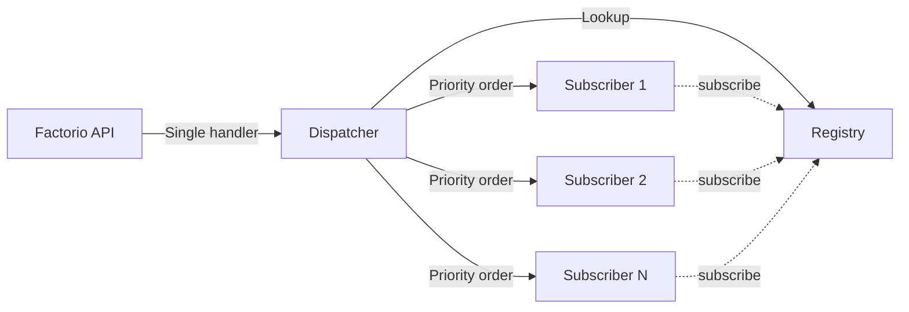

# Event Manager System

A decoupled event management system that allows multiple independent handlers to subscribe to Factorio events with priority-based execution order.

## Overview

The event manager solves Factorio's API limitation where only one handler can be registered per event per mod. It provides:

- **Multiple subscribers per event** - Any number of systems can listen to the same event
- **Priority-based ordering** - Control execution order with explicit priorities
- **Stable sorting** - Equal priority subscribers execute in registration order
- **Error isolation** - One subscriber's error doesn't break others
- **Lazy registration** - Events are only registered with Factorio when needed
- **Automatic type detection** - Works with standard events, custom events, lifecycle events, and nth_tick
- **Self-registration pattern** - Modules register themselves when loaded

## Quick Start

### Basic Subscription

```lua
local tenebris = require("lib.tenebris")

tenebris.event_manager.subscribe(
    tenebris.EVENTS.ON_BUILT_ENTITY,  -- Event to listen to
    "my_system",                       -- Unique subscriber name
    function(event)                    -- Handler function
        game.print("Entity built: " .. event.entity.name)
    end,
    tenebris.PRIORITY.GAMEPLAY         -- Priority (optional, default: 100)
)
```

### Priority Ranges

- **0-99**: Critical infrastructure (composite entities, core systems)
- **100-199**: Gameplay mechanics (spore clearing, resource spawning)
- **200-299**: UI and effects
- **900-999**: Logging and debugging

Lower priority values execute **first**.

## Architecture



## Event Types Supported

### 1. Standard Events
```lua
tenebris.event_manager.subscribe(tenebris.EVENTS.ON_BUILT_ENTITY, "name", handler, priority)
tenebris.event_manager.subscribe(tenebris.EVENTS.ON_PLAYER_MINED_ENTITY, "name", handler, priority)
-- Use tenebris.EVENTS.* for consistency
```

### 2. Custom Events
```lua
local my_custom_event = script.generate_event_name()
event_manager.subscribe(my_custom_event, "name", handler, priority)
```

### 3. Lifecycle Events
```lua
event_manager.subscribe("on_init", "name", handler, priority)
event_manager.subscribe("on_load", "name", handler, priority)
event_manager.subscribe("on_configuration_changed", "name", handler, priority)
```

### 4. Periodic Tick Events
```lua
event_manager.subscribe(60, "every_second", handler, priority)  -- Every 60 ticks
event_manager.subscribe(3600, "every_minute", handler, priority)  -- Every 3600 ticks
```

## Self-Registration Pattern

Modules register their own event handlers when loaded:

```lua
-- scripts/my_system.lua
local tenebris = require("lib.tenebris")

local my_system = {}

function my_system.do_something(entity)
    -- System logic
end

-- Self-register at module load time
tenebris.event_manager.subscribe(tenebris.EVENTS.ON_BUILT_ENTITY, "my_system", function(event)
    if event.entity and event.entity.valid then
        my_system.do_something(event.entity)
    end
end, tenebris.PRIORITY.GAMEPLAY)

return my_system
```

Then in `control.lua`:
```lua
require("lib.tenebris")       -- Initialize tenebris namespace
require("scripts.my_system")  -- Loads and self-registers
```

## API Reference

### `event_manager.subscribe(event_id, name, handler, priority)`

Subscribes a handler to an event.

**Parameters:**
- `event_id` (number|string): Event ID, custom event, lifecycle event name, or tick count
- `name` (string): Unique subscriber name (e.g., "composite_lifecycle", "spore_clearance")
- `handler` (function): Handler function `function(event_data)`
- `priority` (number, optional): Priority value (default: 100). Lower executes first.

**Returns:** `boolean success, string|nil error_message`

**Example:**
```lua
tenebris.event_manager.subscribe(tenebris.EVENTS.ON_BUILT_ENTITY, "my_handler", function(event)
    game.print("Built: " .. event.entity.name)
end, tenebris.PRIORITY.GAMEPLAY)
```

### `event_manager.unsubscribe(event_id, name)`

Removes a subscriber from an event.

**Parameters:**
- `event_id` (number|string): The event ID
- `name` (string): The subscriber name to remove

**Returns:** `boolean success` (true if unsubscribed, false if not found)

### `event_manager.is_registered(event_id, name)`

Checks if a subscriber is registered.

**Parameters:**
- `event_id` (number|string): The event ID
- `name` (string): The subscriber name

**Returns:** `boolean is_registered`

### `event_manager.get_stats()`

Gets statistics about the event manager.

**Returns:** Table with:
- `total_events`: Number of events with subscribers
- `total_subscribers`: Total subscribers across all events
- `setup_events`: Number of events registered with Factorio
- `events`: Per-event subscriber counts

**Example:**
```lua
/c game.print(serpent.block(require("lib.event_manager").get_stats()))
```

### `event_manager.trigger(event_id, event_data)`

Manually triggers an event (for testing).

**Parameters:**
- `event_id` (number|string): The event ID
- `event_data` (table): Event data to pass to subscribers

## Error Handling

Subscribers are wrapped in `pcall` for error isolation:

```lua
-- If subscriber A crashes, subscribers B and C still run
event_manager.subscribe(event, "A", function() error("crash!") end, 10)
event_manager.subscribe(event, "B", function() game.print("B runs") end, 20)
event_manager.subscribe(event, "C", function() game.print("C runs") end, 30)

-- Result: Error logged, B and C execute normally
```

Errors are logged to:
- Factorio log file
- In-game console (if game is available)

## Execution Order

### Priority Sorting

```lua
event_manager.subscribe(event, "system_c", handler, 100)  -- Third
event_manager.subscribe(event, "system_a", handler, 10)   -- First
event_manager.subscribe(event, "system_b", handler, 50)   -- Second

-- Execution order: system_a → system_b → system_c
```

### Stable Sort for Equal Priority

```lua
event_manager.subscribe(event, "first", handler, 100)   -- Executes first
event_manager.subscribe(event, "second", handler, 100)  -- Executes second
event_manager.subscribe(event, "third", handler, 100)   -- Executes third

-- Execution order matches registration order
```

## Dynamic Subscription

Subscriptions can be modified at runtime:

```lua
-- Add a subscriber dynamically
event_manager.subscribe(event, "dynamic", handler, 50)

-- Update an existing subscriber (same name)
event_manager.subscribe(event, "dynamic", new_handler, 75)  -- Updates priority and handler

-- Remove a subscriber
event_manager.unsubscribe(event, "dynamic")
```

**Safety:** Modifications during event dispatch create a new subscriber list, so in-flight dispatches are not affected.

## Examples

### Simple Event Handler

```lua
local tenebris = require("lib.tenebris")

tenebris.event_manager.subscribe(tenebris.EVENTS.ON_PLAYER_CREATED, "welcome_message", function(event)
    local player = game.get_player(event.player_index)
    if player then
        player.print("Welcome to Tenebris!")
    end
end, tenebris.PRIORITY.UI)
```

### Conditional Handler

```lua
local tenebris = require("lib.tenebris")

tenebris.event_manager.subscribe(tenebris.EVENTS.ON_BUILT_ENTITY, "tenebris_only", function(event)
    if not event.entity or not event.entity.valid then
        return
    end
    
    if not tenebris.is_on_tenebris(event.entity) then
        return  -- Skip non-Tenebris entities
    end
    
    game.print("Built on Tenebris: " .. event.entity.name)
end, tenebris.PRIORITY.GAMEPLAY)
```

### Multiple Event Subscription

```lua
local tenebris = require("lib.tenebris")

local function handle_entity_destroyed(event)
    if event.entity and event.entity.valid then
        game.print("Entity destroyed: " .. event.entity.name)
    end
end

-- Subscribe to multiple events with same handler
tenebris.event_manager.subscribe(tenebris.EVENTS.ON_PLAYER_MINED_ENTITY, "cleanup", handle_entity_destroyed, tenebris.PRIORITY.GAMEPLAY)
tenebris.event_manager.subscribe(tenebris.EVENTS.ON_ROBOT_MINED_ENTITY, "cleanup", handle_entity_destroyed, tenebris.PRIORITY.GAMEPLAY)
tenebris.event_manager.subscribe(tenebris.EVENTS.ON_ENTITY_DIED, "cleanup", handle_entity_destroyed, tenebris.PRIORITY.GAMEPLAY)
```

### Periodic Task

```lua
local event_manager = require("lib.event_manager")

-- Run every second (60 ticks)
event_manager.subscribe(60, "health_check", function(event)
    game.print("Tick: " .. event.tick)
end, 100)

-- Run every minute (3600 ticks)
event_manager.subscribe(3600, "hourly_report", function(event)
    game.print("One minute passed!")
end, 100)
```

## Migration from Old Hook System

### Before (Monolithic Hooks)

```lua
-- scripts/hooks/on_built_entity.lua
local system_a = require("scripts.system_a")
local system_b = require("scripts.system_b")

local function on_built_entity(event)
    system_a.handle(event)
    system_b.handle(event)
end

script.on_event(defines.events.on_built_entity, on_built_entity)
```

### After (Self-Registration)

```lua
-- scripts/system_a.lua
local tenebris = require("lib.tenebris")

local system_a = {}

function system_a.handle(event)
    -- Logic
end

tenebris.event_manager.subscribe(tenebris.EVENTS.ON_BUILT_ENTITY, "system_a", system_a.handle, tenebris.PRIORITY.GAMEPLAY)

return system_a
```

```lua
-- scripts/system_b.lua
local tenebris = require("lib.tenebris")

local system_b = {}

function system_b.handle(event)
    -- Logic
end

tenebris.event_manager.subscribe(tenebris.EVENTS.ON_BUILT_ENTITY, "system_b", system_b.handle, tenebris.PRIORITY.UI)

return system_b
```

```lua
-- control.lua
require("lib.tenebris")
require("scripts.system_a")  -- Self-registers
require("scripts.system_b")  -- Self-registers
```

## Debugging

### View Statistics

```lua
/c local stats = tenebris.event_manager.get_stats()
/c game.print(serpent.block(stats))
```

### Check if Registered

```lua
/c game.print(tenebris.event_manager.is_registered(tenebris.EVENTS.ON_BUILT_ENTITY, "my_system"))
```

### Manually Trigger Event

```lua
/c tenebris.event_manager.trigger(tenebris.EVENTS.ON_BUILT_ENTITY, {
    entity = game.player.selected,
    player_index = 1
})
```

### List All Subscribers

```lua
/c local reg = require("lib.event_manager").registry
/c for event_id, subs in pairs(reg.get_registered_events()) do
    for _, sub in ipairs(reg.get_subscribers(event_id)) do
        game.print(string.format("%s: %s (priority %d)", event_id, sub.name, sub.priority))
    end
end
```

## Performance Considerations

- **Lazy Registration**: Events are only registered with Factorio when first subscriber is added
- **Stable Sorting**: Subscribers are sorted once at subscription time, not on every event
- **Table Reallocation**: Subscribe/unsubscribe creates new tables (safe but allocates memory)
- **Error Isolation**: `pcall` has minimal overhead (~1-2% performance impact)

## Best Practices

1. **Use descriptive names**: `"composite_lifecycle"` not `"handler1"`
2. **Group related subscribers**: Use consistent naming like `"system_name_event_type"`
3. **Choose appropriate priorities**: Critical infrastructure < gameplay < UI < logging
4. **Handle invalid entities**: Always check `entity.valid` in handlers
5. **Return early**: Skip unnecessary work with early returns
6. **Document priority choices**: Comment why a priority was chosen

## See Also

- [Composite Entity Library](../composite_entity/README.md) - Uses event manager for lifecycle
- Factorio API: [Events](https://lua-api.factorio.com/latest/events.html)

